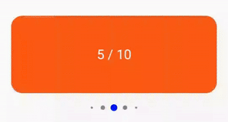

# PagerIndicator Library for Jetpack Compose

This library provides a simple and customizable pager indicator for Android apps using Jetpack Compose. It includes two types of indicators to visually represent the user’s current page in a horizontal or vertical pager.

## Screenshots

### PagerIndicator



### PagerWormIndicator


### Pager & PagerWormIndicator vertical


## Features

- **Two Indicator Types**:
    - **Pager Worm Indicator** - A dynamic "worm-like" animation that visually represents the transition between pages.
    - **Pager Dot Indicator** - A standard dot indicator for simpler paging needs.
- **Customizable**:
    - Set the colors, sizes, and spacing of the dots.
    - Choose between horizontal and vertical orientations.
    - Define the number of visible dots.
- **Flexible State Handling**:
    - Use the `PagerState` directly, or, for non-standard paginated elements, you can pass a custom `currentPageFraction` to represent the fractional position of the current page. This flexibility allows you to integrate the indicator with other components beyond `PagerState`.

## Installation

Add the library to your project by including it in your Gradle dependencies.

```gradle
dependencies {
    implementation "mx.platacard:compose-pager-indicator:0.0.7"
}
```

## Usage

To use the indicators, simply call `PagerWormIndicator` or `PagerIndicator` within your `Composable` function, passing in the `PagerState` (or `currentPageFraction` for custom components) and other parameters to customize the appearance.

### Example

```kotlin
import androidx.compose.foundation.pager.PagerState
import androidx.compose.material3.*
import androidx.compose.runtime.*
import mx.platacard.pagerindicator.PagerWormIndicator
import mx.platacard.pagerindicator.PagerIndicator
import mx.platacard.pagerindicator.PagerIndicatorOrientation

@Composable
fun MyPagerIndicator(pagerState: PagerState) {
    PagerWormIndicator(
        pagerState = pagerState,
        activeDotColor = Color.Blue,
        dotColor = Color.Gray,
        dotCount = 5,
        orientation = PagerIndicatorOrientation.Horizontal
    )
    
    // OR use the dot indicator:
    
    PagerIndicator(
        pagerState = pagerState,
        activeDotColor = Color.Green,
        dotColor = Color.LightGray,
        dotCount = 5,
        orientation = PagerIndicatorOrientation.Vertical
    )
}
```

## Parameters

| Parameter              | Description                                                                                               |
|------------------------|-----------------------------------------------------------------------------------------------------------|
| `pagerState`           | The `PagerState` that represents the current state of the pager.                                          |
| `currentPageFraction`  | Fractional position representing the current page for custom components.                                  |
| `modifier`             | `Modifier` for applying layout adjustments.                                                               |
| `activeDotColor`       | Color of the active dot.                                                                                  |
| `dotColor`             | Color of the inactive dots.                                                                               |
| `dotCount`             | Number of dots displayed (should be odd unless equal to `pageCount`).                                     |
| `dotPainter` (optional)| Custom `Painter` for rendering the dots.                                                                  |
| `normalDotSize`        | Size of inactive dots.                                                                                    |
| `activeDotSize`        | Size of the active dot.                                                                                   |
| `minDotSize`           | Size of dots displayed at the edges.                                                                      |
| `space`                | Space between dots.                                                                                       |
| `orientation`          | `Horizontal` or `Vertical` orientation of the indicator.                                                  |

## Using a Custom `currentPageFraction`

If you're not using a traditional pager but still want an indicator for a custom component, you can replace `pagerState` with a `currentPageFraction` parameter. `currentPageFraction` represents the fractional position of the current page and allows integration with custom elements.

```kotlin
PagerIndicator(
    pageCount = 10,
    currentPageFraction = derivedStateOf { /* Your logic to calculate fractional page position */ },
    activeDotColor = Color.Blue,
    dotColor = Color.Gray,
    dotCount = 5
)
```